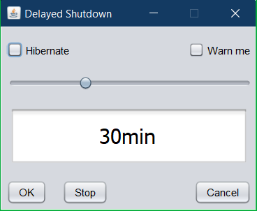

# delayedshutdown
A desktop application to turn off the computer after a given delay

Building the application: The repository contains a Netbeans project that uses ant for building the JAR file.

Using the application:
* Use the slider to set up the remaining time
* Start countdown via the "OK" button.
* Cancel the countdown via the "Stop" button.
* Quit the tool via the "Cancel" button.
* Select hibernation mode via the corresponding checkbox, otherwise a regular shutdown is done

